# Analytical Science Blog: Exploring the Latest Discoveries

## Introduction

Welcome to the Analytical Science Blog, a platform dedicated to showcasing the latest discoveries and advancements in the field of analytical chemistry. Here, we delve into the fascinating world of analytical techniques and their applications, providing insights into cutting-edge research and technological breakthroughs.

Analytical science plays a pivotal role in unraveling the mysteries of matter and understanding the intricate details of various substances. It encompasses a wide range of techniques that enable scientists to investigate the composition, structure, properties, and interactions of different materials. Through this blog, we aim to bring you closer to the exciting developments in the field and highlight the incredible contributions of analytical chemistry to scientific progress.

## Exploring the Techniques

In this blog, we will explore a myriad of analytical techniques, shedding light on their principles, methodologies, and real-world applications. Join us as we dive into the inner workings of the following techniques:

- **Microscopy:** Discover the incredible resolution and versatility offered by various microscopy techniques, ranging from traditional optical microscopy to advanced electron microscopy. Explore how researchers use these tools to visualize and characterize materials at the micro- and nanoscale, unraveling intricate structures and unraveling hidden secrets.

- **Nuclear Magnetic Resonance (NMR):** Delve into the world of NMR spectroscopy, a powerful technique for elucidating molecular structures and probing chemical environments. Explore how NMR allows researchers to analyze the magnetic properties of atomic nuclei, providing valuable information about molecular interactions, conformational changes, and dynamic processes.

- **Vibrational Spectroscopy:** Unravel the mysteries of molecular vibrations and their interaction with electromagnetic radiation. We will explore techniques such as infrared (IR) spectroscopy and Raman spectroscopy, which provide invaluable insights into molecular structure, functional groups, and chemical composition.

- **Gas Chromatography (GC):** Explore the power of gas chromatography in separating and analyzing volatile compounds. Discover how GC techniques employ a stationary phase and a carrier gas to separate mixtures based on their volatility, enabling precise identification and quantification of various components. Learn about the different detection methods, such as flame ionization detection or mass spectrometry, that are commonly used to enhance compound identification.

- **High-Performance Liquid Chromatography (HPLC):** Immerse yourself in the world of high-performance liquid chromatography, a versatile technique for separating and analyzing a wide range of compounds in liquid samples. We will explore the principles behind HPLC, the various modes of separation (such as reverse phase, ion exchange, and size exclusion), and the different detection methods employed. Gain insights into the applications of HPLC in pharmaceutical analysis, environmental monitoring, and other fields.

- **Thermal Analysis:** Embark on a journey into the realm of thermal analysis, where we study the physical and chemical properties of substances as they undergo temperature changes. Discover techniques such as differential scanning calorimetry (DSC) and thermogravimetric analysis (TGA), which allow scientists to investigate phase transitions, thermal stability, decomposition processes, and more. Explore how thermal analysis provides valuable information about material characteristics and behavior under different temperature conditions.

- **Rheology:** Dive into the world of rheology, the study of how materials flow and deform under applied forces or stresses. Uncover the fascinating properties of liquids and soft solids through techniques such as viscosity measurements, shear rate analysis, and viscoelasticity studies. Learn how rheological analysis contributes to fields such as polymer science, food technology, and pharmaceutical formulation, enabling the optimization of material properties and performance.

## Join Our Community

We aspire to cultivate a community of inquisitive minds who are passionate about analytical science. Join us in discussions, share your knowledge, and interact with fellow enthusiasts. Let's inspire each other and drive future advancements in the realm of analytical chemistry.

## Get Involved

We welcome contributions from researchers, professionals, and students who wish to share their expertise, experiences, and discoveries. If you are interested in contributing to the Analytical Science Blog, please reach out to us through the contact information provided below.

## Stay Updated

Don't miss out on the latest updates and discoveries in the world of analytical science. Follow our blog and join us on this exhilarating exploration. Together, let's unravel the mysteries, celebrate the discoveries, and push the boundaries of scientific knowledge.

# Table of Contents

- [Analytical Science Blog: Exploring the Latest Discoveries](#analytical-science-blog-exploring-the-latest-discoveries)
  - [Introduction](#introduction)
  - [Exploring the Techniques](#exploring-the-techniques)
  - [Join Our Community](#join-our-community)
  - [Get Involved](#get-involved)
  - [Stay Updated](#stay-updated)
- [Table of Contents](#table-of-contents)
- [User Experience Design (UX)](#user-experience-design-ux)
  - [The Strategy Plane](#the-strategy-plane)
    - [Site Goals](#site-goals)
    - [Agile Planning](#agile-planning)
    - [Epic](#epic)
      - [Epic 1: User Management](#epic-1-user-management)
      - [Epic 2: Blog Management](#epic-2-blog-management)
      - [Epic 3: Documentation Improvements](#epic-3-documentation-improvements)
      - [Epic 4: Blog Enhancements](#epic-4-blog-enhancements)
  - [The Scope Plane](#the-scope-plane)
    - [Features](#features)
      - [User Registration and Authentication](#user-registration-and-authentication)
      - [Email Verification and Password Reset](#email-verification-and-password-reset)
      - [Blog Post list](#blog-post-list)
      - [User Profile](#user-profile)
      - [User-Generated Posts, Comments, and Interactions](#user-generated-posts-comments-and-interactions)
      - [Analytics](#analytics)
      - [automatic mail](#automatic-mail)
    - [Future Features](#future-features)
- [The Structure Plane](#the-structure-plane)
  - [The Skeleton Plane](#the-skeleton-plane)
    - [Wireframes](#wireframes)
      - [index.html, tags.html, category.html](#indexhtml-tagshtml-categoryhtml)
      - [profile.html](#profilehtml)
      - [addpost.html](#addposthtml)
      - [post\_details.html](#post_detailshtml)
      - [authentication](#authentication)
      - [error pages](#error-pages)
    - [Database Design](#database-design)
    - [Security](#security)
  - [The Surface Plane](#the-surface-plane)
    - [Design](#design)
    - [Colour Scheme](#colour-scheme)
    - [Typography](#typography)
    - [Imagery](#imagery)
      - [Default Category Images](#default-category-images)
      - [User-Provided Featured Images](#user-provided-featured-images)
      - [Image Insertion with CKEditor](#image-insertion-with-ckeditor)
- [Technologies](#technologies)
  - [Technology](#technology)
    - [DJANGO](#django)
    - [Other technologies](#other-technologies)
- [Testing](#testing)
  - [Authentication](#authentication-1)
    - [Description](#description)
    - [Steps](#steps)
    - [Expected](#expected)
    - [Actual](#actual)
    - [Description](#description-1)
    - [Steps](#steps-1)
    - [Expected](#expected-1)
    - [Actual](#actual-1)
    - [Description](#description-2)
    - [Steps](#steps-2)
    - [Expected](#expected-2)
    - [Actual](#actual-2)
    - [Description](#description-3)
    - [Steps](#steps-3)
    - [Expected](#expected-3)
    - [Actual](#actual-3)
  - [Add Post (repeated twice with and without Featured image)](#add-post-repeated-twice-with-and-without-featured-image)
    - [Description](#description-4)
    - [Steps](#steps-4)
    - [Expected](#expected-4)
    - [Actual](#actual-4)
  - [Profile](#profile)
    - [Description](#description-5)
    - [Steps](#steps-5)
    - [Expected](#expected-5)
    - [Actual](#actual-5)
  - [Post](#post)
    - [Description](#description-6)
    - [Steps](#steps-6)
    - [Expected](#expected-6)
    - [Actual](#actual-6)
    - [Description](#description-7)
    - [Steps](#steps-7)
    - [Expected](#expected-7)
    - [Actual](#actual-7)
    - [Description](#description-8)
    - [Steps](#steps-8)
    - [Expected](#expected-8)
    - [Actual](#actual-8)
    - [Actual](#actual-9)
    - [Description](#description-9)
    - [Steps](#steps-9)
    - [Expected](#expected-9)
    - [Actual](#actual-10)
  - [filter pages](#filter-pages)
    - [Description](#description-10)
    - [Steps](#steps-10)
    - [Expected](#expected-10)
    - [Actual](#actual-11)
    - [Description](#description-11)
    - [Steps](#steps-11)
    - [Expected](#expected-11)
    - [Actual](#actual-12)
    - [Description](#description-12)
    - [Steps](#steps-12)
    - [Expected](#expected-12)
    - [Actual](#actual-13)
  - [admin](#admin)
    - [Description](#description-13)
    - [Steps](#steps-13)
    - [Expected](#expected-13)
    - [Actual](#actual-14)
    - [Description](#description-14)
    - [Steps](#steps-14)
    - [Expected](#expected-14)
    - [Actual](#actual-15)
    - [Description](#description-15)
    - [Steps](#steps-15)
    - [Expected](#expected-15)
    - [Actual](#actual-16)
  - [Navigation Links](#navigation-links)
  - [Footer](#footer)
  - [Unit Testing](#unit-testing)
  - [Accessibility](#accessibility)
  - [Validator Testing](#validator-testing)
- [Deployment](#deployment)
  - [Version Control](#version-control)
  - [Heroku Deployment](#heroku-deployment)
  - [Run Locally](#run-locally)
  - [Fork Project](#fork-project)
- [Credits](#credits)
- [Content](#content)
- [Acknowledgements](#acknowledgements)

# User Experience Design (UX)

## The Strategy Plane

### Site Goals
Our aim at the Analytical Science Blog is to serve as a comprehensive platform dedicated to the field of analytical chemistry. We are committed to showcasing the latest discoveries, advancements, and applications of analytical techniques. Our goal is to provide valuable insights into cutting-edge research and technological breakthroughs, enabling our readers to stay informed and engaged with the ever-evolving world of analytical science.

Through our blog, we strive to bridge the gap between scientific research and the broader community, making complex concepts accessible and engaging to a wide range of audiences. Whether you are a student, researcher, industry professional, or simply someone with a passion for science, we invite you to join us on this exciting journey of exploration and discovery.
### Agile Planning
This project was developed using agile methodologies, following the principles of delivering small features in incremental sprints. In total, there were 4 sprints, evenly spaced out over 2 weeks, to ensure a steady pace of development.

All project tasks were organized into epics and categorized based on their priority under the labels of "Must have," "Should have," and "Could have." During the sprint planning, the epics were assigned to specific sprints and story pointed according to their complexity. This approach allowed the team to focus on completing the critical and high-priority stories first, followed by the medium-priority stories, and finally the low-priority or "nice to have" features. By prioritizing in this manner, the core requirements of the project were ensured to be completed, while additional features were added if there was available capacity.

To track the progress and manage the project tasks, a Kanban board was created using GitHub Projects. You can find the Kanban board [here](https://github.com/users/Frangidha/projects/4), where you can access more detailed information about the project cards. Each story, except for the documentation tasks, includes a comprehensive set of acceptance criteria that define the functionality needed to mark the story as complete. This ensures clear guidelines and criteria for evaluating the successful implementation of each feature.
### Epic

#### Epic 1: User Management

- User Story #1: User Registration and Login 
- User Story #9: Create and Edit Blog Posts User 
- User Story #10: Choose Different Templates for Blog Posts 
- User Story #20: Account Verification Email

#### Epic 2: Blog Management

- User Story #2: Create and Edit Blog Posts admin 
- User Story #18: Consistency and Formatting documentation
- User Story #19: Search engine 
- User Story #21: Review Blog Post

#### Epic 3: Documentation Improvements

- User Story #3: Add Media to Blog Posts 
- User Story #12: Missing Table of Contents documentation
- User Story #13: Section Descriptions documentation
- User Story #14: Missing Testing Section documentation
- User Story #15: Lack of Detailed Instructions documentation
- User Story #16: Incomplete Credits and Acknowledgements documentation
- User Story #17: Content and Examples documentation

#### Epic 4: Blog Enhancements

- User Story #4: Categorize Blog Posts 
- User Story #5: Comment Moderation 
- User Story #6: Tag Blog Posts 
- User Story #7: View Blog Analytics 
- User Story #8: Send email with new post
## The Scope Plane
### Features

#### User Registration and Authentication

The User Registration and Authentication feature enables individuals to create accounts on the website by providing necessary information such as a username, email address, and password. It ensures a secure login process and access to personalized content or features. Key points about this feature include:

- **User Registration:** Users can create accounts by providing required information, such as a username, email address, and password.
- **Authentication:** Registered users are authenticated through their provided credentials when logging into the website.
- **Secure Login:** Users can securely log in using their registered credentials to access personalized content or features.
- **Data Protection:** User authentication helps protect sensitive user data and ensures that only authorized individuals can access restricted areas of the website.
- **Account Management:** Upon successful authentication, users can view their account details, manage their profile, and engage in personalized interactions.
- **Personalized Experiences:** User registration and authentication are often essential for websites that offer personalized experiences, user-specific settings, or user-generated content.

Implementing the User Registration and Authentication feature enhances the security of the website, enables personalized user experiences, and allows users to access and manage their accounts and preferences effectively.

#### Email Verification and Password Reset 

- The email verification feature ensures that users' email addresses are valid and verified before activating their accounts.
- It adds an extra layer of security and helps prevent unauthorized access to user accounts.
  after registration:
  
  Verification email
  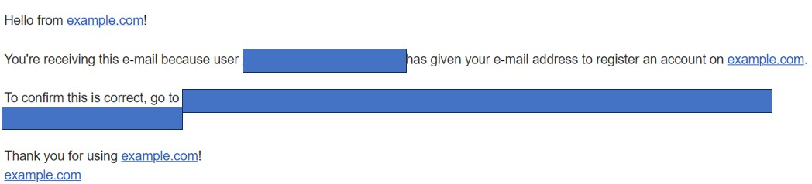

- The password reset feature allows users to securely reset their passwords if they forget them or need to change them.
- Users can request a password reset link, which will be sent to their registered email address, allowing them to create a new password.
  
  password reset email
  

#### Blog Post list

- **Latest Posts First:** The blog posts are displayed in reverse chronological order, with the most recently created post appearing at the top of the blog feed. This ensures visitors can easily access the newest content without scrolling.

- **Searching:** This capability allows so quickly search post based on their title. 
  
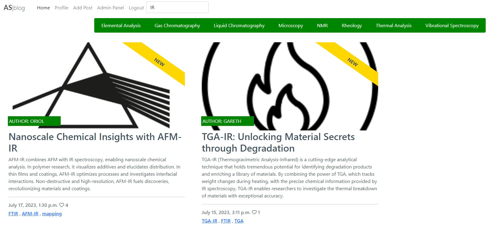

- **tags:** The blog posts have each their own tags which makes it easy to filter post which have similar field/topic but using a different technique.
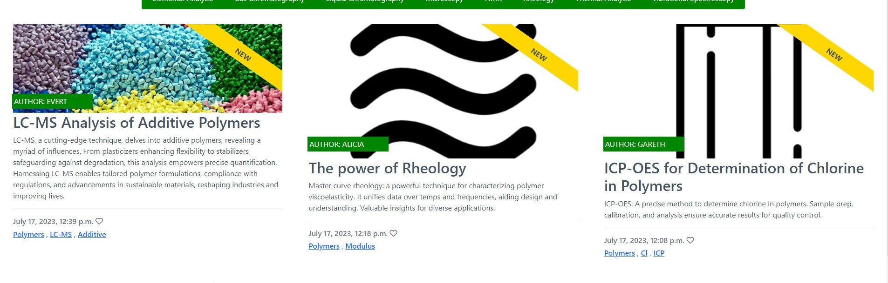

- **Categories:** The blog posts are displayed in reverse chronological order, with the most recently created post appearing at the top of the blog feed. This ensures visitors can easily access the newest content without scrolling.

#### User Profile
- The user profile feature provides users with a dedicated space within the website to manage their personal information and interactions.
- Users can update their profile details, such as their name, profile picture, occupation, expertises, and contact information.
- Additionally, users can customize their profile with optional details like a bio.
- The user profile allows users to have an overview of their posts, including those awaiting approval, archived posts, and published posts.
- Including the user profile feature enhances the user experience by allowing users to personalize their account settings, maintain their information, and tailor their interactions according to their preferences.

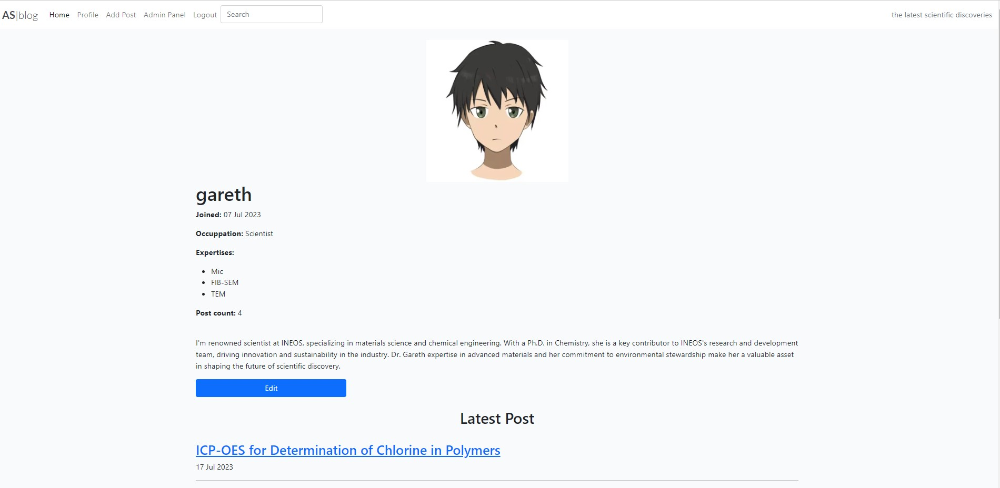
  
#### User-Generated Posts, Comments, and Interactions

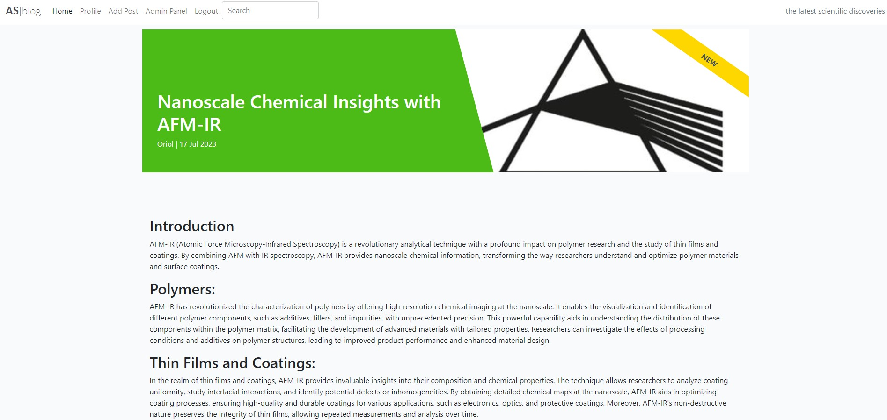 

- Users can create their own posts, sharing their thoughts, ideas, or experiences with the community.
- The created posts are sent for approval before they are published to ensure content quality and adherence to guidelines.

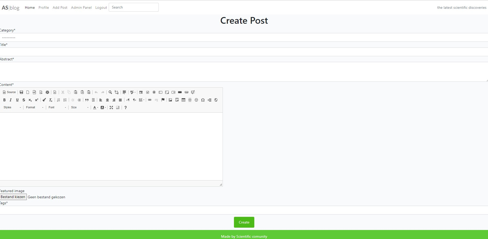

- Users have the ability to archive their posts, keeping them for reference while removing them from the main published feed.(unarchiving is also possible)

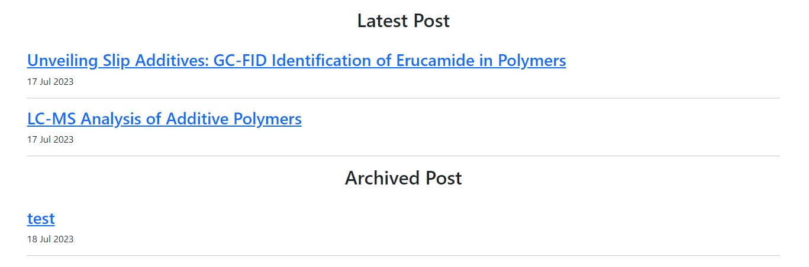  

- Is new Banner for the first 7 days that the post is created

   
 
- Additionally, users can like or upvote posts, showing their appreciation or agreement.
  
   
 
- Users can leave comments on published posts and also have the option to delete their own comments if desired.
   

#### Analytics

- The system tracks and displays the hit count for each post, allowing the admin to see which posts are the most popular and attract the most views.
- The analytics feature provides valuable insights into user engagement and the performance of different posts.
- Admins can utilize this information to understand user preferences, identify popular topics, and make data-driven decisions for content management and improvement.

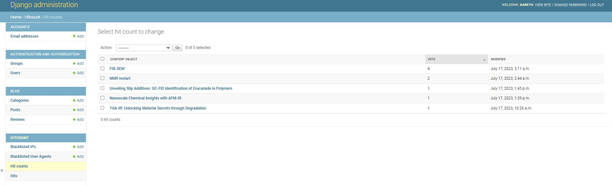

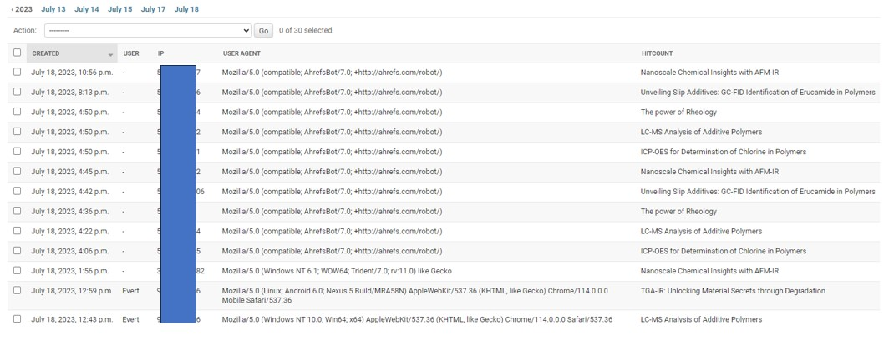

#### automatic mail

When a new POST is approved an automatic mail we be send to the registered members.

### Future Features

- **Post Editing with Approval:** Users can edit posts, but changes need approval before becoming visible to others, maintaining content quality.

- **Comment Editing:** Users can edit comments for better clarity or corrections after posting.

- **Analytics Graphs:** Visualize user engagement and platform performance using interactive graphs like line charts and bar graphs.

# The Structure Plane

## The Skeleton Plane

### Wireframes

#### index.html, tags.html, category.html

- **Website**
  - Not Logged In
    
    
  
  - Logged In
    
    

- **Phone**
  - General Phone
    
    
  
  - Not Logged In
    
    
   
  - Logged In
    
    

#### profile.html

- **Website**
  - Not Logged In
    
    
  
  - Logged In
    
    

- **Phone**
  - Not Logged In
  
    
  
  - Logged In
  
    

#### addpost.html

- **Website**
  
  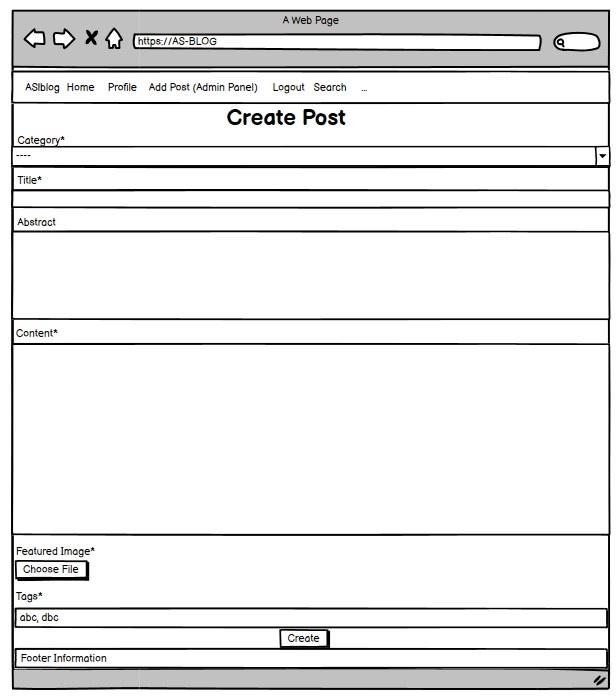

- **Phone**
  
  

#### post_details.html

- **Website**
  - Not Logged In
  
    
  
  - Logged In (Author of the Comment)
    
    
  
  - Logged In (Author of the Post, No Comment)
    
    
  
  - Logged In (Waiting for Approval)
    

- **Phone**
  - Not Logged In
- 
    

  - Logged In (Author of the Post, No Comment)
  
    
  
  - Logged In (Waiting for Approval)
  
    

#### authentication

- **Website**
  - Sign Up
  
    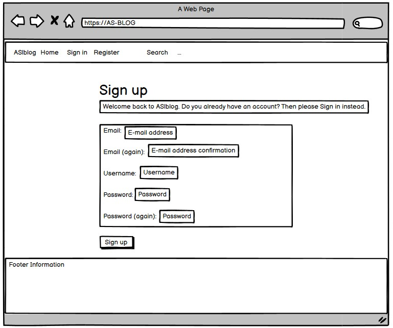

  - Sign In
  
    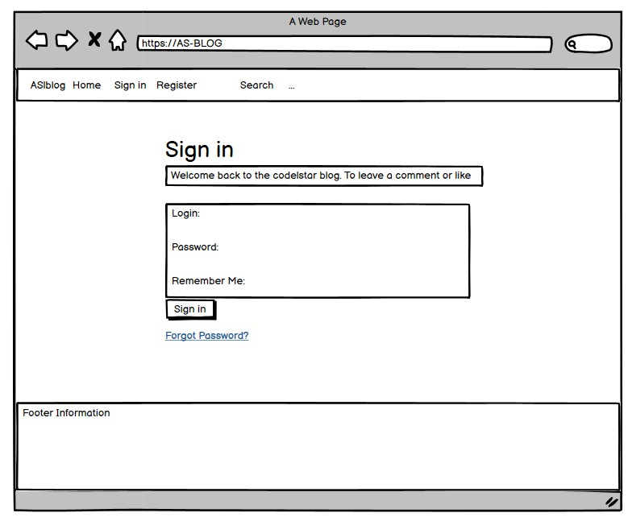

  - Sign Out
  
    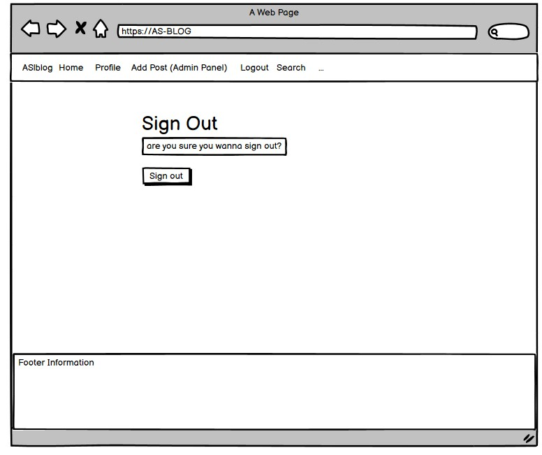

  - Password Reset
- 
    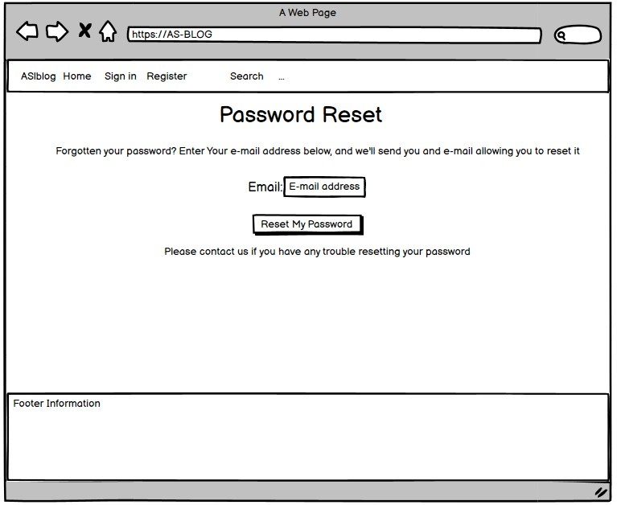

- **Phone**
  - Sign Up

    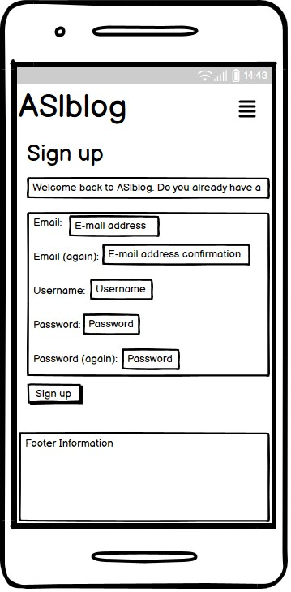

  - Sign In
  
    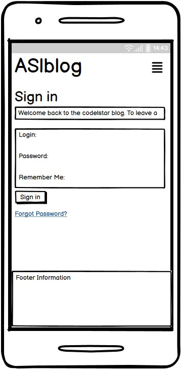

  - Sign Out
  
    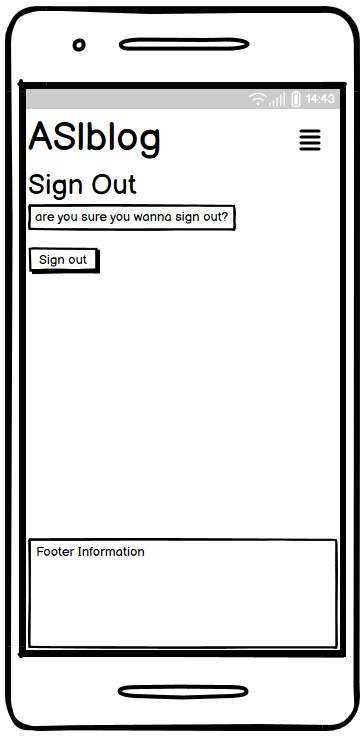

  - Password Reset
- 
    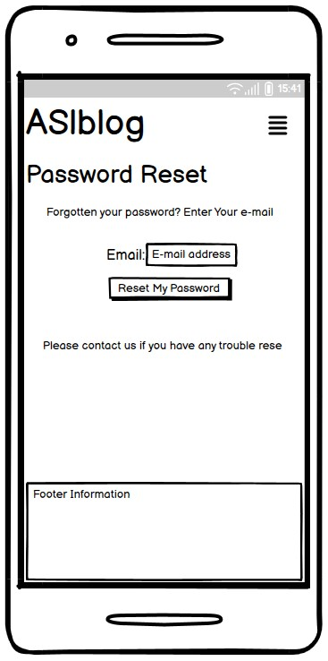

#### error pages

- **Website**
  - 404
    
    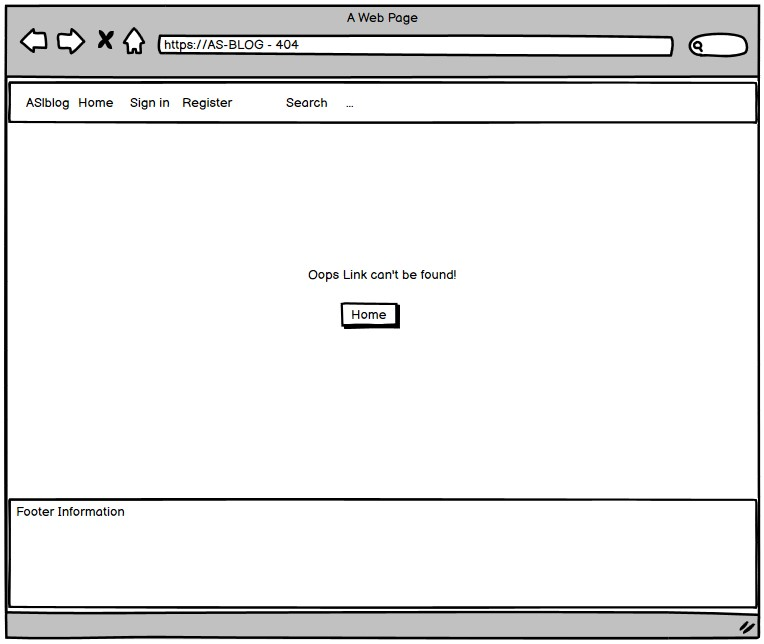
  
  - 403
    
    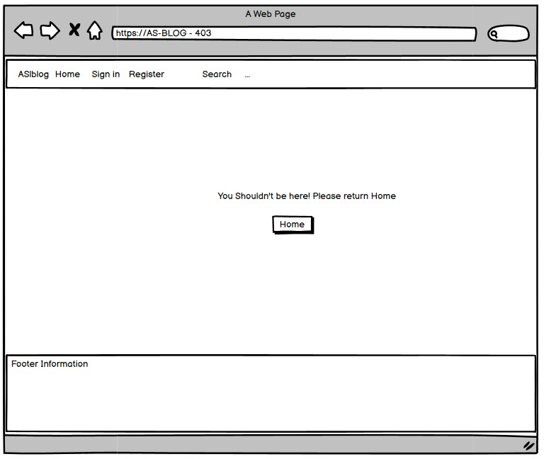
  - 500
  
    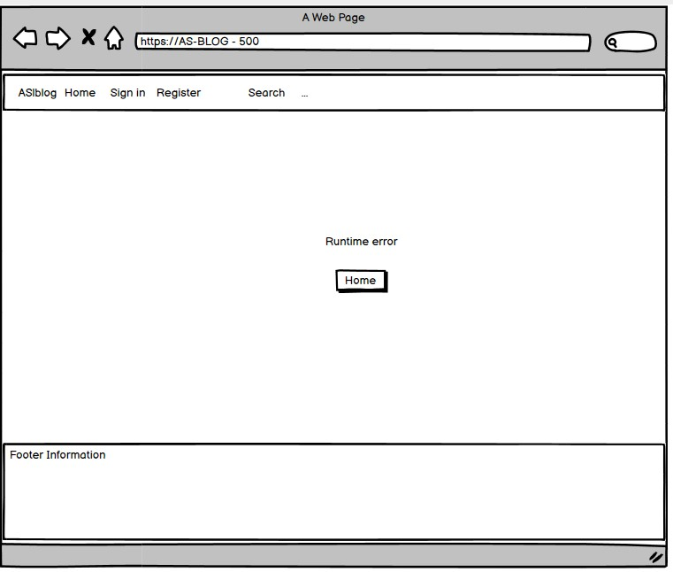

- **Phone**
  - 404
    
    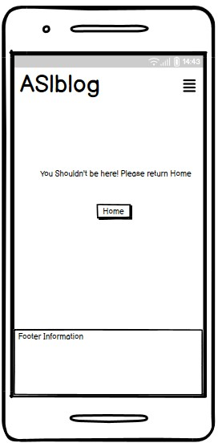

  - 403
    
    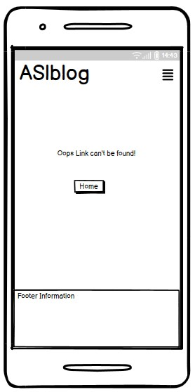

  - 500
  
    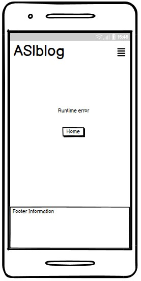

### Database Design

The database was designed to allow CRUD functionality to be available to registered users, when signed in. The user model is at the heart of the application as it is connected the the post, profile and  review linked by primary/foreign key relationships.

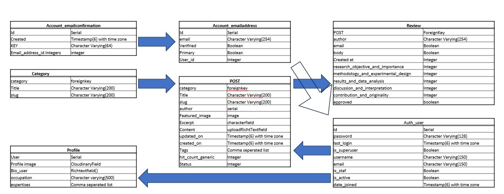

### Security

Views were secured by using the django class based view mixin, UserPassesTextMixin. A test function was created to use the mixin and checks were ran to ensure that the user who is trying to access the page is authorized. Any staff restricted functionality, user edit/delete functionality listed in the features was secured using this method.

Environment variables were stored in an env.py for local development for security purposes to ensure no secret keys, api keys or sensitive information was added the the repository. In production, these variables were added to the heroku config vars within the project.

## The Surface Plane
### Design
Minimalistic Design: The project follows a minimalistic design approach, emphasizing simplicity, clean lines, and ample white space. This minimalistic aesthetic enhances focus on content and provides a modern and uncluttered interface.

Responsive Design: The project is designed to be responsive, adapting to different screen sizes and devices. This ensures an optimal user experience across desktop, tablet, and mobile devices.

Consistent Visual Language: A consistent visual language is maintained throughout the project, with uniform colors, typography, and UI elements. This consistency enhances usability and creates a cohesive experience.
### Colour Scheme
The project embraces a sophisticated and visually captivating color scheme that seamlessly blends white, gray, and green hues. This thoughtfully chosen palette serves to elevate readability and infuse the project with a vibrant and contemporary ambiance. Here is an overview of the key colors employed:

White: As the project's cornerstone, the primary background color gracefully envelops the visual landscape, promoting a sense of openness and emphasizing the core content.

Gray: Comprising a range of shades, including #445261, gray, and #4A4A4F, the grayscale palette is skillfully utilized for borders, backgrounds, and delicate accents. These understated tones imbue the design with depth and an air of sophistication.

Green: Infused with life and energy, a vivid shade of green (#4CBB1 and dark green for extra effect) is selectively applied as an accent color to command attention towards crucial elements. Its infusion brings a touch of nature's vibrancy and rejuvenation to the project.

The cohesive utilization of this color scheme aims to create a visually pleasing and harmonious user experience, cultivating an environment that is both polished and contemporary.
### Typography
Fonts
Primary Font: The project utilizes the "Lato" font as the primary typeface. Lato is a sans-serif font known for its modern and clean aesthetic, making it highly legible in various sizes and weights.

Heading Styles: The project employs a hierarchy of heading styles to structure content. Headings use the Lato font with different font weights and sizes to indicate different levels of importance.

Body Text: Body text is set in Lato with a regular font weight, ensuring optimal legibility and readability for extended reading.

Font Sizes and Weights
Primary Font Size: The project uses a base font size of 1.4rem for most of the content, providing a comfortable reading experience across different devices.

Font Weights: Different font weights, such as 300 (thin) and 700 (bold), are selectively applied to headings and other text elements to establish visual hierarchy and emphasize important information.
### Imagery

#### Default Category Images

In the absence of user-provided featured images, the project automatically assigns default category images that represent each category's theme or topic. These carefully selected images provide visual cues and ensure a cohesive browsing experience. For example, a microscope symbolizes microscopy, while a droplet represents liquid chromatography, a technique used in chemical analysis. These default symbols enhance consistency, aid in categorization, and contribute to an overall visually appealing interface.

#### User-Provided Featured Images

On the other hand, users have the freedom to choose and input their own featured images for their content, such as blog posts or articles. These user-provided images take priority over default category images, allowing users to personalize their content and capture the attention of the audience. These featured images serve as engaging thumbnails or header visuals, enhancing the overall visual appeal and enticing users to explore the content further.

#### Image Insertion with CKEditor

To further enrich the content/post, the project integrates CKEditor, which allows users to seamlessly insert images within their text. Users can upload images from their local devices or provide image URLs, enabling them to incorporate relevant imagery that supports their written content. The seamless integration of CKEditor's image insertion feature enhances the visual appeal and provides users with flexibility in incorporating visually appealing and informative images.

By combining the default category images, user-provided featured images, and the image insertion capabilities of CKEditor, the post creates a visually rich and dynamic experience. Users can enjoy a consistent visual representation through default images, while also having the flexibility to personalize their content with unique and eye-catching featured images. The ability to insert images within the content further enhances the visual storytelling aspect of the project, allowing users to effectively convey their message with the support of relevant and visually appealing imagery.
# Technologies

## Technology

### DJANGO
The project incorporates several technologies and libraries to enhance its functionality. Here is an expanded list of key technologies and their respective versions used in the project:

- asgiref==3.6.0
- cloudinary==1.33.0 (used for image storage and management)
- dj-database-url==0.5.0
- dj3-cloudinary-storage==0.0.6
- Django==3.2.19
- django-allauth==0.54.0 (provides user authentication and login features)
- django-appconf==1.0.5
- django-braces==1.15.0
- django-ckeditor==6.5.1 (enables a rich text editor for modifying templates)
- django-cloudinary-storage==0.3.0 (integrates Cloudinary with Django for image storage)
- django-crispy-forms==1.14.0
- django-etc==1.4.0
- django-hitcount==1.3.5 (used for blog analytics, such as post views)
- django-imagekit==4.1.0
- django-js-asset==2.0.0
- django-model-utils==4.3.1
- django-resized==1.0.2
- django-star-ratings==0.9.2
- django-summernote==0.8.20.0
- django-taggit==4.0.0 (provides tagging functionality for blog posts)
- djangorestframework==3.14.0
- gunicorn==20.1.0
- oauthlib==3.2.2
- pilkit==2.0
- Pillow==9.5.0
- psycopg2==2.9.6
- PyJWT==2.7.0
- python3-openid==3.2.0
- pytz==2023.3
- requests-oauthlib==1.3.1
- sqlparse==0.4.4
- swapper==1.3.0
- urllib3==1.26.15
- whitenoise==6.4.0

### Other technologies

- HTML: Markup language used to structure the content of web pages.
- CSS: Style sheet language used for the presentation and styling of web pages.
- Bootstrap: A popular CSS framework for building responsive and mobile-first websites.
- Favicon: A small icon that represents your website in the browser's tab or bookmark bar.
  
# Testing

## Authentication

### Description

Ensure a user can sign up for the website.

### Steps

1. Navigate to [AS-blog](https://as-blog.herokuapp.com/) and click Register.
2. Enter email, username, and password.
3. Click Sign up.

### Expected

An email is received with a link to sign up. Upon clicking the link, registration is successful.

### Actual

An email is received with a link to sign up. Upon clicking the link, registration is successful.

---

### Description

Ensure a user can log in once signed up.

### Steps

1. Navigate to [AS-blog](https://as-blog.herokuapp.com/).
2. Enter login details created in the previous test case.
3. Click login.

### Expected

User is successfully logged in and redirected to the home page.

### Actual

User is successfully logged in and redirected to the home page.

---

### Description

Ensure a user can sign out.

### Steps

1. Login to the website.
2. Click the logout button.
3. Click confirm on the confirm logout page.

### Expected

User is logged out.

### Actual

User is logged out.

---
### Description

Ensure a user can log in once signed up.

### Steps

1. Navigate to [AS-blog](https://as-blog.herokuapp.com/).
2. Enter login details created in the previous test case.
3. Click login.

### Expected

User is successfully logged in and redirected to the home page.

### Actual

User is successfully logged in and redirected to the home page.

## Add Post (repeated twice with and without Featured image)

### Description

Ensure a new post can be created

### Steps

1. Navigate to the page - Login if prompted.
2. Enter the following details:
   - Category: Microscopy
   - Title: Optical Microscopy
   - Abtract: Advancements in optical microscopy: Enhanced imaging, fluorescence techniques, and multimodal approaches offer insights in diverse scientific fields, from cellular imaging to nanomaterial characterization, with potential for medical diagnostics and personalized medicine.
   -content

    Optical microscopy has played a vital role in scientific research, providing researchers with a powerful tool for visualizing and analyzing a wide range of samples with high resolution and contrast. Over the years, significant advancements have been made in optical microscopy techniques, resulting in improved imaging capabilities and expanding the scope of applications. In this comprehensive review, we aim to provide an overview of the recent developments in optical microscopy and explore their diverse applications across various scientific disciplines.

    Conventional bright-field microscopy, although widely used, has its limitations, particularly when it comes to visualizing transparent or unstained samples. To address these challenges, advanced contrast-enhancing techniques have been developed, including phase contrast, differential interference contrast (DIC), and dark-field microscopy. These techniques have revolutionized the visualization of cellular structures and subcellular components, enabling detailed examination even in samples without specific staining or labeling.

    Fluorescence microscopy has emerged as a powerful tool for studying biological systems, allowing researchers to selectively label and visualize specific molecules or structures within complex samples. In recent years, there have been significant advancements in fluorescence microscopy techniques. Confocal microscopy, multiphoton microscopy, stimulated emission depletion (STED) microscopy, and stochastic optical reconstruction microscopy (STORM) are just a few examples. These techniques offer exceptional spatial resolution, allowing researchers to investigate subcellular dynamics and molecular interactions with remarkable precision.

    Moreover, there is a growing interest in combining optical microscopy with other imaging modalities, such as spectroscopy and optical coherence tomography (OCT), to gain complementary information about the structural, chemical, and functional properties of samples. These multimodal approaches provide deeper insights into complex biological systems and materials, facilitating a comprehensive understanding of their behavior and characteristics.

    The applications of optical microscopy are widespread across numerous scientific disciplines. In cell biology, optical microscopy enables the visualization of cellular processes, organelles, and cellular interactions. In neuroscience, it aids in the mapping of neuronal circuits and studying brain activity. In materials science and nanotechnology, optical microscopy plays a crucial role in characterizing nanomaterials and understanding their properties. Furthermore, these advancements have the potential to impact medical diagnostics, drug discovery, and personalized medicine, offering new avenues for improved healthcare.

    In conclusion, recent advancements in optical microscopy have significantly enhanced our ability to visualize and analyze biological and material samples with unprecedented detail. The development of novel contrast-enhancing techniques, fluorescence imaging modalities, and multimodal approaches has expanded the capabilities of optical microscopy, enabling researchers to push the boundaries of scientific understanding across various disciplines. As these techniques continue to evolve, we anticipate further breakthroughs that will drive new discoveries and innovations in the years to come.

    + add an image

- Featured image: yes/No

- Tags: Mic, Optical

3. Click Create.
4. Navigate to the profile
    - Post is waiting approval 
   

### Expected

Form successfully submits, the post is waiting approval the post can found on the profile part(waiting approval).

### Actual

Form successfully submits, the post is waiting approval the post can found on the profile part(waiting approval).

---
## Profile

### Description

Ensure a profile can be edited.

### Steps

1. Navigate to the page (profile) - Login in first
2. Enter the following details:
   - Image: new image
   - Occupation: Scientist
   - Bio: I'm renowned scientist at INEOS, specializing in materials science and chemical engineering. With a Ph.D. in Chemistry, she is a key contributor to INEOS's research and development team, driving innovation and sustainability in the industry. Dr. Hayes's expertise in advanced materials and her commitment to environmental stewardship make her a valuable asset in shaping the future of scientific discovery.
   - Experises
3. Click edit.

### Expected

Form successfully submits, the profile is edited with the new added image and information

### Actual

Form successfully submits, the profile is edited with the new added image and information

---
## Post

### Description

Post are displayed Latest, Archived and waiting approval 

### Steps

1. Navigate to the page (profile) - Login in first + author(of some post)
2. Click on the Latest Post
3. Click the archive button
   - succes to index.html
4. Navigate to the page (profile) - post moved to Archived post
5. Click on the Post
6. Click on the Unarchive button
7. Navigate to the page (profile) - post moved to Latest Post

### Expected

The post was successfully archived and then unarchived

### Actual

The post was successfully archived and then unarchived

---

### Description

Ensure a user can successfully Create a review.

### Steps

1. Navigate to the a post - Login in first
   - You should observe the Leave comment section
2. Enter the following details:
   - This innovation is amazing 
    
   - Methodology and Experimental design
     - 2-fair
   - Results and data analysis
     - 3-Average
   - Discussion and interpreation
     - 4-Good
   - Contribution and Originality
     - 4-Excellent
   - Research Objective and Importance 
     - 1-Needs Improvement
   
3. Click Create 

### Expected

Review is succesfully Created and waiting approval.

### Actual

Review is succesfully Created and waiting approval.

--- 

### Description

Ensure a user can delete his own review

### Steps

1. Navigate to the a post(where you have comment) - Login in first
   - You should observe the comment section with your comment
   
2. Click Delete

### Expected

the review is deleted

### Actual

the review is deleted

--- 

### Actual

Ensure people can like a post

--- 

### Description

Ensure people can like a post

### Steps

1. Navigate to the a post
   
2. Click on the Like(heart) button 

### Expected

Page refreshes and post is liked 

### Actual

Page refreshes and post is liked

## filter pages

### Description

ensure the search give improves search capabilities

### Steps

1. Click on the Search bar
2. Enter the following details:
   AFM
3. Click enter

### Expected

The post containing the entered word or part will show.

### Actual

The post containing the entered word or part will show.

---

### Description

ensure the user can filter based on categories

### Steps

1. Navigate to the home page 
2. Click on a Category

### Expected

Only the post of the same Category will be shown

### Actual

Only the post of the same Category will be shown

---

### Description

ensure the user can filter based on Tags

### Steps

1. Navigate to Home page
2. Click one of Tags

### Expected

Only the post with the Same tag will be shown

### Actual

Only the post with the Same tag will be shown

## admin 

### Description

ensure admin can change status of a blog past

### Steps

1. Sign in as a staff user.
2. Select the Post.
3. Select the post 
4. Change status (Draft - Publisched - Archive)
5. Navigate to Home page (Publisched) - other not visible

### Expected

Appearing and dissapearing of post on the blog 

### Actual

Appearing and dissapearing of post on the blog

---

### Description

ensure the admin can see the views on each Post 

### Steps

1. Click on a few post 
2. Sign in as a staff user.
3. go to HIT COUNT
4. hitcount +1
5. if clicked a again
6. No change

### Expected

first time somebody clicks a post it will be registered the second one won't 
until after 5 days and not a maximum of 5 per IP address 

### Actual

first time somebody clicks a post it will be registered the second one won't
until after 5 days and not a maximum of 5 per IP address

---

### Description

Ensure people get an email when I new post get's approved

### Steps

1. post in Draft
2. Change status to Publisched
3. Check your Email

### Expected

an email should be received. with the abstract and title of the new post with a link to the website.

### Actual

an email should be received. with the abstract and title of the new post with a link to the website.

## Navigation Links

Testing was performed to ensure all navigation links on the respective pages navigated to the correct pages as per the design. This was done by clicking on the navigation links on each page.

- Home -> index.html
- Profile -> Profile.html
- Add Post -> add_post.html
- Post -> Post_detail.html
- Logout -> Sign out all auth page
- Login -> Sign in all auth page
- Register -> Sign up all auth page

All navigation links directed to the correct pages as expected.

## Footer

Testing was performed on the footer links by clicking the Font Awesome icons and ensuring that the Facebook icon opened Facebook in a new tab and the Twitter icon opened Twitter in a new tab. These behaved as expected.

- Facebook -> https://www.facebook.com/
- Twitter -> https://twitter.com/
- Instagram -> https://www.instagram.com/
- youtube -> https://www.youtube.com/

## Unit Testing

Unit tests were created to test some basic functionality such as templates used and redirects. These can be found in the `tests.py` files in the respective apps.

## Accessibility

Wave Accessibility tool was used throughout development and for final testing of the deployed website to check for any aid accessibility testing. Testing was focused to ensure the following criteria were met:

- All forms have associated labels or `aria-labels` so that this is read out on a screen reader to users who tab to form inputs.
- Color contrasts meet a minimum ratio as specified in WCAG 2.1 Contrast Guidelines.
- Heading levels are not missed or skipped to ensure the importance of content is relayed correctly to the end user.
- All content is contained within landmarks to ensure ease of use for assistive technology, allowing the user to navigate by page regions.
- All non-textual content had alternative text or titles so descriptions are read out to screen readers.
- HTML page `lang` attribute has been set.
- ARIA properties have been implemented correctly.
- WCAG 2.1 coding best practices are being followed.

## Validator Testing

All pages were run through the W3 HTML Validator. Initially, there were some errors due to stray script tags, misuse of headings within spans, and some unclosed elements. All of these issues were corrected, and all pages passed validation.

HTML Validator

All pages were run through the official Pep8 validator to ensure all code was PEP8 compliant. Some errors were shown due to blank spacing

# Deployment

Provide a brief introduction and description of the project.

## Version Control

The project was created using the Visual Studio Code editor and pushed to the remote repository 'Gars-Steakhouse' on GitHub.

The following git commands were used throughout development to push code to the remote repo:

- `git add <file>` - This command was used to add the file(s) to the staging area before they are committed.
- `git commit -m "commit message"` - This command was used to commit changes to the local repository queue ready for the final step.
- `git push` - This command was used to push all committed code to the remote repository on GitHub.

## Heroku Deployment

The site was deployed to Heroku. The steps to deploy are as follows:

1. Navigate to Heroku and create an account.
2. Click the "New" button in the top right corner.
3. Select "Create new app" and enter the app name.
4. Choose the region and click "Create app".
5. Go to the "Resources" tab and search for Heroku Postgres. Select "Hobby Dev" and continue.
6. In the "Settings" tab, click "Reveal Config Vars" and add the following config vars:
   - SECRET_KEY: [Your secret key]
   - DATABASE_URL: [This should already exist with the add-on of PostgreSQL]
   - EMAIL_HOST_USER: [Email address]
   - EMAIL_HOST_PASS: [Email app password]
   - CLOUDINARY_URL: [Cloudinary API URL]
7. Click the "Deploy" tab and scroll down to "Connect to GitHub". Sign in/authorize when prompted.
8. Search for the repository you want to deploy and click "Connect".
9. Scroll down to "Manual deploy" and choose the main branch.
10. Click "Deploy".
11. The app should now be deployed.

The live link can be found here: [Live Site](https://example.com)

## Run Locally

To run the project locally, follow these steps:

1. Clone the GitHub repository by navigating to the repository link and copying the URL.
2. Open your IDE of choice and open the terminal.
3. Type `git clone <copied-git-url>` in the terminal to clone the repository to your local machine.

## Fork Project

Forking is commonly used to propose changes to someone else's project or to use someone else's project as a starting point for your own idea.

To fork the project:

1. Navigate to the GitHub repository you want to fork.
2. On the top right of the page, click the "Fork" button.
3. This will create a duplicate of the full project in your GitHub repository.

# Credits
Special thanks to my mentor, Gareth McGirr ([Gareth-McGirr](https://github.com/Gareth-McGirr)), for his invaluable guidance, bug-finding assistance, and constant motivation throughout the development of this website. Gareth's expertise and encouragement have been instrumental in improving the functionality and inspiring me to continually learn and grow as a developer.
# Content

This project incorporates insights and knowledge from relevant research articles obtained through [ResearchGate](https://www.researchgate.net/). These scholarly publications, accessed on ResearchGate, have enriched the project's content and supported its objectives. The articles were properly cited within the project's posts, ensuring appropriate attribution and acknowledgment. By leveraging the expertise shared on ResearchGate, the project benefits from authoritative information and insights from experts in the field. The inclusion of research articles enhances the project's credibility, promotes evidence-based information, and adheres to academic integrity standards.
# Acknowledgements
This project acknowledges the following resources and individuals who contributed to its development:

- **Code Institute Curriculum:** The Code Institute curriculum was utilized as a valuable learning resource throughout the development of this project. For more information, please visit the [Code Institute Full Stack Software Development Diploma Curriculum](https://codeinstitute.net/global/full-stack-software-development-diploma/?utm_term=code%20institute&utm_campaign=CI+-+ROW+-+Search+-+Brand&utm_source=adwords&utm_medium=ppc&hsa_acc=8983321581&hsa_cam=15207113220&hsa_grp=130324141420&hsa_ad=635849256710&hsa_src=g&hsa_tgt=aud-1971138565381:kwd-319867646331&hsa_kw=code%20institute&hsa_mt=e&hsa_net=adwords&hsa_ver=3&gad=1&gclid=Cj0KCQjwy9-kBhCHARIsAHpBjHhP3FHAGnhwmkB83_44PoOgU4d8e1cn01dQweFpMJnEfjnLAfhNMTgaAmNSEALw_wcB).

- **Search Functionality Documentation:** The search functionality in this project was implemented using the documentation provided in the tutorial [Building a Search Functionality Django Blog](https://www.codesnail.com/building-a-search-functionality-django-blog-9/) by Code Snail.

- **Django Crash Course:** The category model in this project was developed with the guidance from the [Code with Stein Django Crash Course](https://github.com/SteinOveHelset/crashblog) GitHub repository.

- **Profile App Tutorial:** The profile app in this project was inspired by and created with the assistance of the YouTube tutorial [Django Blog (2/4) - Profile App - Authentication | Django Crash Course](https://www.youtube.com/watch?v=sBjbty691eI&list=PLXuTq6OsqZjbCSfiLNb2f1FOs8viArjWy&ab_channel=DeeMc) by Dee Mc.

- **Matt Rudge from Code Institute:** Grateful acknowledgement goes to Matt Rudge from Code Institute for his valuable contributions. You can find his work and resources in the [Code Institute Django3blog](https://github.com/Code-Institute-Solutions/Django3blog/tree/master/12_final_deployment) GitHub repository.
  
- **Portfolio-Project-4-SizzleAndSteak:** Acknowledgements to Gareth McGirr for the inspiration and basis provided for implementing the verification email and password reset functionalities in this project. [GitHub Repository](https://github.com/Gareth-McGirr/Portfolio-Project-4-SizzleAndSteak)
- **CKEditor Images to Cloudinary:**
   The project utilizes the CKEditor plugin to manage and upload images, and it integrates with Cloudinary for image storage and management. A tutorial or video guide that helped in implementing this feature can be found at the following link:[CKEditor Images to Cloudinary](https://www.youtube.com/watch?v=_QTESQ6vSWE&ab_channel=Devmaesters)
- **Banner Styling:**
   The project implements banner styling, allowing text to be displayed over images. To achieve the desired effect, we used a solution from the following Stack Overflow post: Stack Overflow Solution: [Text Banner Over Image Not Aligned Properly](https://stackoverflow.com/questions/70867102/text-banner-over-image-not-aligned-properly)
